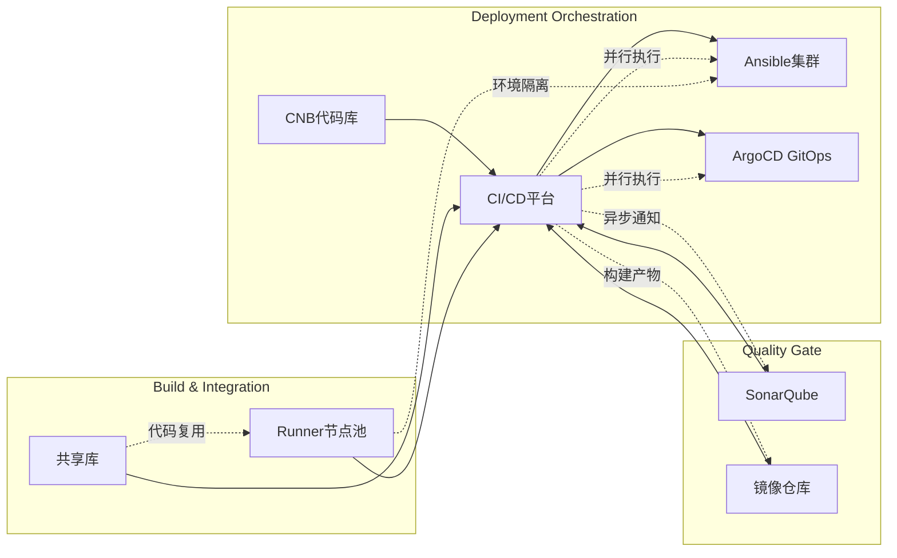

# 一、CI/CD工具选型分析
<Tip>以下从用户需求的关键维度，对比 Jenkins、GitLab CI/CD、云效（阿里云）三款工具的优缺点：</Tip>

| 需求维度         | Jenkins                                                  | GitLab CI/CD                                             | 云效（阿里云）                                           |
| -------------------- | ------------------------------------------------------------ | ------------------------------------------------------------ | ------------------------------------------------------------ |
| 多环境适配       | 支持混合云、Kubernetes、Docker，通过插件（如Kubernetes插件）实现动态节点调度。 | 内置GitLab Runner，支持Docker和Kubernetes，但混合云适配需额外配置。 | 深度绑定阿里云生态，对非阿里云环境支持较弱，混合云需复杂配置。 |
| 权限管理         | 通过 Role Strategy插件 实现细粒度权限控制（如按应用、环境划分），支持LDAP/OAuth集成。 | 内置RBAC权限模型，但复杂权限场景（如跨团队隔离）需依赖GitLab项目级配置，灵活性较低。 | 权限控制与阿里云RAM体系强绑定，企业内多租户管理需依赖阿里云账号体系，自主性受限。 |
| 安全性           | 支持敏感数据加密（Credentials插件）、审计日志，可集成Vault等安全工具。 | 内置密钥管理（Settings > CI/CD > Variables），但加密算法依赖GitLab版本，开源版存在潜在风险。 | 阿里云KMS加密服务集成，但数据传输需通过公网，敏感数据需额外脱敏处理。 |
| 效率与扩展性     | 分布式架构支持横向扩展，通过Master/Slave节点分担负载；插件生态（如Parallel Test）优化并行构建。 | 基于GitLab Runner的分布式执行，但资源调度依赖GitLab实例性能，大规模并发时易遇瓶颈。 | 阿里云底层资源弹性伸缩能力强，但自建流水线时需按量付费，成本与业务波动强相关。 |
| All-in-One原则   | 需自行集成代码托管（如Git）、制品管理（如Nexus）等工具，初期配置复杂，但后期可控性高。 | 与GitLab代码仓库深度集成，但制品管理、监控等需依赖第三方工具（如Prometheus）。 | 完全集成阿里云生态（代码托管、制品库、监控），但技术栈封闭，非阿里云环境难以适配。 |
| 特殊环境支持     | 通过 Docker Agent 或自定义Runner（如MacStadium）支持Mac/Election环境，灵活性强。 | 依赖Docker镜像构建，Mac环境需自行搭建Runner，对非标准环境支持有限。 | 仅支持阿里云ECS环境，无法直接适配Mac/Election等异构环境。    |
| 日志与中断处理   | Web界面实时日志流，支持API暂停/恢复任务，结合 Prometheus 监控构建状态。 | 实时日志需通过Web Terminal，中断后需手动重试，缺乏自动化恢复机制。 | 日志与阿里云日志服务（SLS）集成，但中断后需重新触发流水线，无法断点续传。 |
| 高并发与执行效率 | 分布式架构支持千级并发，通过 Throttle Plugin 限制资源争用，构建速度可线性扩展。 | 默认单节点Runner并发有限，需自建Runner集群，大规模场景下性能衰减明显。 | 依赖阿里云ACK（Kubernetes）弹性调度，但冷启动时间较长，突发流量下易出现排队延迟。 |
| 全流程打通       | 通过 Pipeline as Code 定义端到端流程，支持与Jira、SonarQube等工具深度集成。 | 内置GitLab Issues、Merge Request联动，但第三方工具集成需开发适配层。 | 与阿里云效需求管理、测试服务等无缝衔接，但非阿里云工具链（如GitHub）需额外配置。 |

<Card title="👆️ 点击这里，查看CI/CD工具选型分析"href="/cicd/02">
</Card>


# 二、Jenkins核心部署流程

下载jenkins
Jenkins提供了多种部署方式，用户可以根据自己的需求选择合适的版本：

- 官方网站下载：访问 [Jenkins官网](https://www.jenkins.io/download/) 下载最新版本
- 版本选择：
  - LTS版本：长期支持版本，稳定性好，建议生产环境使用
  - Weekly版本：每周更新版本，包含最新特性，适合开发测试环境


<Card title="👆️ 点击这里，查看Jenkins核心部署流程"href="/cicd/03">
</Card>

# 三、Jenkins 常规配置&插件管理
全局安全配置
<Steps>
  <Step title="访问控制">
    - CSRF Protection：防止跨站请求伪造攻击
    
    - 代理兼容性：配置Jenkins通过代理服务器访问,通常Jenkins使用一个TCP端口和JNLP节点代理通讯。
    
  </Step>
  <Step title="授权策略">
    - Role-Based Strategy 基于角色的策略(需要安装`Role-Based Strategy`插件后才能使用，不展开说明，后续安装插件演示)
    
  </Step>
  <Step title="安全域">
    - 👍Jenkins数据库：使用Jenkins内置用户数据库
    
    - LDAP：集成企业LDAP目录服务(需要安装插件后才能使用)
  </Step>
</Steps>

<Card title="👆️ 点击这里，查看Jenkins 常规配置&插件管理"href="/cicd/04">
</Card>

# 四、Jenkins共享库设计与应用

- 目录结构

  ```
  shared-lib/
  ├── src/                # Groovy工具类
  │   └── com/
  │       └── utils/      # 通用工具（如日志、邮件通知）
  ├── vars/               # 全局变量与Pipeline步骤
  │   └── deploy.groovy   # 标准化部署流程
  └── resources/          # 静态资源（如脚本、配置模板）
  ```

- 核心功能

  - 标准化构建流程：封装Maven构建、Docker镜像打包等通用步骤。
  - 跨项目复用：通过`@Library('shared-lib@main')`引入共享库，减少代码冗余。
  - 版本控制：结合Git分支管理共享库迭代，支持灰度发布回滚。


# 五、Jenkins+Ansible批量发布与回退

- 架构设计




- Ansible Playbook示例

  ```yaml deploy.yaml
  - hosts: "{{ target }}"
    tasks:
      - name: 备份当前版本
        copy:
          src: "{{ app_path }}/current"
          dest: "{{ backup_dir }}/{{ timestamp }}"
      - name: 部署新版本
        template: app.conf.j2
        notify: 重启服务
  ```

- 回退策略

  - 版本快照：通过Ansible备份历史版本，支持一键回滚至指定时间点。
  - 元数据管理：记录每次发布的版本号、变更内容，便于追溯。


# 六、Jenkins Runner模式与多环境构建

- Runner节点分类

  | 节点类型   | 环境配置           | 适用场景   |
  | -------------- | ---------------------- | -------------- |
  | Node.js Runner | Node.js 18 + npm 9     | 前端项目构建   |
  | Maven Runner   | JDK 11 + Maven 3.8.6   | Java项目编译   |
  | Docker Runner  | Docker 24.0 + BuildKit | 镜像构建与推送 |

- 配置示例

  ```groovy Jenkinsfile
  pipeline {
    agent {
      label 'nodejs-18'  // 根据环境选择Runner
    }
    stages {
      stage('Build') {
        steps {
          sh 'npm install && npm run build'
        }
      }
    }
  }
  ```

- 隔离性保障：通过Docker容器实现环境隔离，避免依赖冲突。


# 七、Jenkins+ArgoCD实现K8S GitOps发布

- ArgoCD配置流程
  1. 定义Application资源

     ```yaml myapp.yaml
     apiVersion: argoproj.io/v1alpha1
     kind: Application
     metadata:
       name: myapp
     spec:
       destination:
         server: https://kubernetes.default.svc
         namespace: default
       source:
         path: manifests/
         repoURL: https://github.com/myorg/myrepo.git
         targetRevision: main
       project: default
       syncPolicy:
         automated: {}  # 自动同步
     ```
  2. 同步策略
     - 自动同步：Git变更自动触发K8s资源更新。
     - 手动同步：需审批后执行，适用于生产环境。

- 回滚机制

  - Git历史回滚：通过`git checkout <commit>`回退代码，ArgoCD自动同步。
  - 紧急回滚：使用`argocd app rollback myapp --to-revision <revision>`。


# 八、代码质量与安全扫描

- SonarQube集成

  ```groovy Jenkinsfile
  stage('SonarQube Scan') {
    steps {
      withSonarQubeEnv('SonarQube') {
        sh 'mvn sonar:sonar -Dsonar.projectKey=myproject'
      }
    }
  }
  ```

- 容器镜像扫描

  - 工具选择：Trivy、Clair、Anchore。
  - 流水线集成：在构建阶段扫描镜像漏洞，阻断高风险制品。


# 九、流水线优化策略

- 构建通知

  - 即时通讯：集成钉钉/企业微信机器人，推送构建结果。
  - 邮件通知：配置SMTP服务，发送详细报告。

- 参数化构建

  ```groovy Jenkinsfile
  parameters {
    choice(name: 'ENV', choices: ['dev', 'pre', 'prod'], description: '部署环境')
  }
  ```

- 缓存优化

  - 依赖缓存：利用Jenkins Pipeline缓存Maven/NPM仓库。
  - 镜像层缓存：Dockerfile中合理分层，减少重复构建。


# 十、其他关键模块

- 监控与告警
  - Prometheus+Grafana：监控Jenkins队列、构建成功率、节点资源使用率。
  - 日志分析：ELK Stack集中收集Jenkins Agent日志。
- 权限管理
  - RBAC：通过Jenkins Role Strategy插件限制用户操作权限。
  - 审计日志：记录敏感操作（如删除任务、修改配置）。
- 灾备方案
  - 多活部署：在不同云服务商部署Jenkins集群，通过DNS切换实现故障转移。
  - 定期备份：备份Jenkins配置、共享库、Ansible Playbook。


# 十一、最终实现效果

1. 全链路自动化：从代码提交到K8s部署，全程通过Jenkins流水线驱动。
2. 环境一致性：通过Runner节点和Ansible确保开发、测试、生产环境统一。
3. 安全合规：SonarQube扫描+镜像漏洞检测，阻断低质量代码和恶意镜像。
4. 高可用性：K8s集群+ArgoCD实现应用自愈，故障自动恢复。

技术栈全景：


# 十二、参考资料
- https://pig4cloud.com/ 微服务项目-Pig