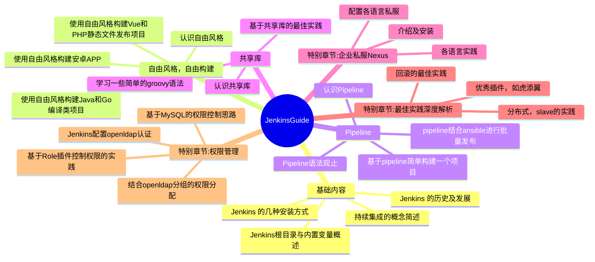

## 基础

### 内联代码

要将一个`单词`或`短语`表示为代码，请将其包含在反引号(`)中。

```
要将一个`单词`或`短语`表示为代码，请将其包含在反引号(`)中。
```

### 代码块

使用[围栏式代码块](https://www.markdownguide.org/extended-syntax/#fenced-code-blocks)，方法是将代码包含在三个反引号中，并在前导反引号后面跟上代码片段的编程语言，以获得语法高亮显示。您还可以选择在编程语言后面写上代码的名称。

```java HelloWorld.java
class HelloWorld {
    public static void main(String[] args) {
        System.out.println("Hello, World!");
    }
}
```

````md
```java HelloWorld.java
class HelloWorld {
    public static void main(String[] args) {
        System.out.println("Hello, World!");
    }
}
```
````