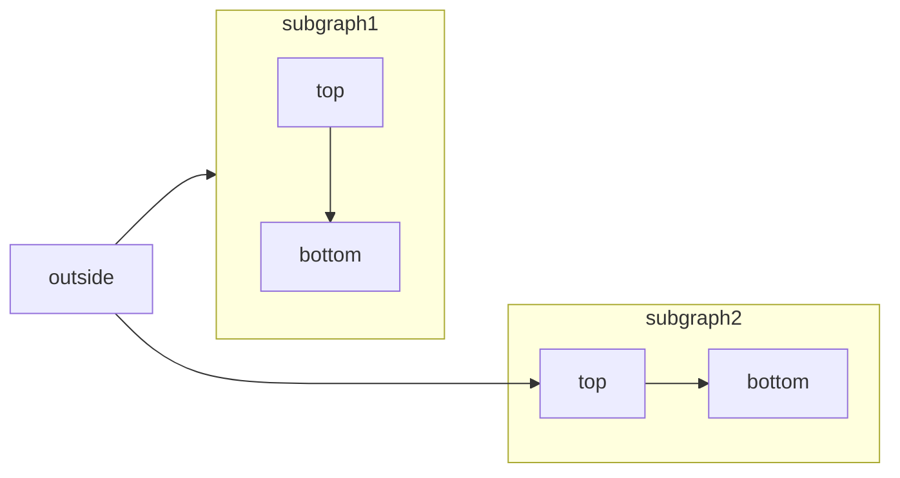

# TODO
- [x] Jenkins 常规配置&插件管理，TODO+写作技巧
- [ ] 首页大屏，替换4个图，分别对应四个项目
- [ ] Jenkins 内置变量概述
- [ ] Jenkins 数据目录管理概述
- [ ] Jenkins 构建方式【手动构建，API构建，与其他系统联动，gitlab 提交代码webhook触发(主动)+Jenkins 轮询Gitlab 检测到代码变更触发构建(被动)】
- [ ] Jenkins 项目分类【view视图，floder文件夹，更具自己的需求进行分类】


# 常用写作技巧

## 用于切换内容可见性的下拉组件

<AccordionGroup>
  <Accordion title="FAQ without Icon">
    You can put other components inside Accordions.

    ```java HelloWorld.java
    class HelloWorld {
        public static void main(String[] args) {
            System.out.println("Hello, World!");
        }
    }
    ```
    Check out the [Accordion](/components/accordions) docs for all the supported props.
  </Accordion>


  <Accordion title="FAQ with Icon" icon="alien-8bit">
    Check out the [Accordion](/components/accordions) docs for all the supported props.
  </Accordion>


  <Accordion title="FAQ without Icon">
    Check out the [Accordion](/components/accordions) docs for all the supported props.
  </Accordion>

</AccordionGroup>

## 标注
<Note>这会在内容中添加注释</Note>
<Warning>这引发了一个需要注意的警告</Warning>
<Info>这引起了对重要信息的注意</Info>
<Tip>这提出了一个有用的提示</Tip>
<Check>这为我们带来了一个 checked 状态</Check>


## 步骤说明
<Steps>
  <Step title="第一步">
    可以写代码，可以放图片
  </Step>
  <Step title="第二步">
    可以写代码，可以放图片
  </Step>
  <Step title="第三步">
    可以写代码，可以放图片
  </Step>
</Steps>


## 使用 Tabs 组件切换内容

<Tabs>
  <Tab title="First Tab">
    ☝️ Welcome to the content that you can only see inside the first Tab.
    ```java HelloWorld.java
      class HelloWorld {
          public static void main(String[] args) {
              System.out.println("Hello, World!");
          }
      }
    ```
  </Tab>
  <Tab title="Second Tab">
    ✌️ Here's content that's only inside the second Tab.
  </Tab>
  <Tab title="Third Tab">
    💪 Here's content that's only inside the third Tab.
  </Tab>
</Tabs>


## 代码组
<CodeGroup>

```javascript helloWorld.js
console.log("Hello World");
```
```python hello_world.py
print('Hello World!')
```
```java HelloWorld.java
class HelloWorld {
    public static void main(String[] args) {
        System.out.println("Hello, World!");
    }
}
```
</CodeGroup>


## 文字/图片 卡片

文字卡片-带超链接
<Card title="百度一下" href="https://baidu.com">
  This is how you use a card with an icon and a link. Clicking on this card
  brings you to the Columns page.
</Card>

文字卡片-不带超链接
<Card title="百度一下">
  This is how you use a card with an icon and a link. Clicking on this card
  brings you to the Columns page.
</Card>


图片卡片-带超链接
<Card title="图片标题" img="/images/index-light.webp" href="https://baidu.com">
  图片说明
</Card>

图片卡片-不带超链接
<Card title="图片标题" img="/images/index-light.webp">
  图片说明
</Card>

## 以网格格式并排显示卡片

带超链接
<Columns cols={2}>
  <Card title="第一张卡" href="https://baidu.com">
    卡片说明
  </Card>
  <Card title="第二张卡" href="https://baidu.com">
    卡片说明
  </Card>
  <Card title="第三张卡" href="https://baidu.com">
    卡片说明
  </Card>
  <Card title="第四张卡" href="https://baidu.com">
    卡片说明
  </Card>
</Columns>

不带超链接
<Columns cols={2}>
  <Card title="第一张卡">
    卡片说明
  </Card>
  <Card title="第二张卡">
    卡片说明
  </Card>
  <Card title="第三张卡">
    卡片说明
  </Card>
  <Card title="第四张卡">
    卡片说明
  </Card>
</Columns>


## 悬浮提示
<Tooltip tip="提示内容">文本内容</Tooltip>


## 使用 Frame 组件将图像居中

带字幕的图片
<Frame caption="字幕字幕字幕字幕字幕字幕">
  
</Frame>

不带字幕的图片
<Frame>
  
</Frame>


## 更新提示组件
<Update label="2026-06-05" description="v0.1.1">
Changelog
- d6c4c95 【修复】代理地址为空时的bug
- f4a3d82 【调整】部分授权API的顺序
- f9c593c 【修复】通知告警的提示信息
- b40da53 【调整】WEBHOOK参数传递为空时的默认值
- f38af15 【调整】webhook参数的提示和顺序
- 573e7af 【调整】网站名描述
</Update>


## Mermaid 显示图表



## 表格

在标题行中的连字符的左侧，右侧或两侧添加冒号（:），将列中的文本对齐到左侧，右侧或中心。

| 标题1    | 标题2      | 标题3                    |
| :-------- | :-----------:|--------------------------:|
| 左对齐左对齐     | 居中对齐居中对齐居中对齐      |     右对齐右对齐               |
| 左对齐左对齐      | 居中对齐居中对齐居中对齐      |       右对齐右对齐             |
| 左对齐左对齐   | 居中对齐居中对齐居中对齐      |  右对齐右对齐                   |


| 标题1    | 标题2      |
| :-------- | -----------:|
| 左对齐左对齐     | 右对齐右对齐      |
| 左对齐左对齐      | 右对齐右对齐      |
| 左对齐左对齐   | 右对齐右对齐      |